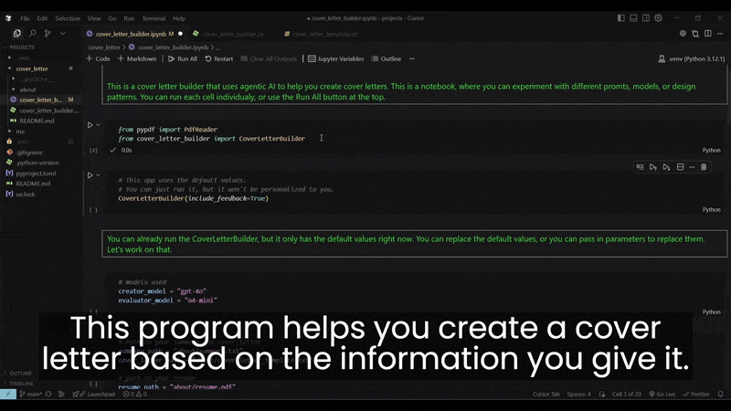
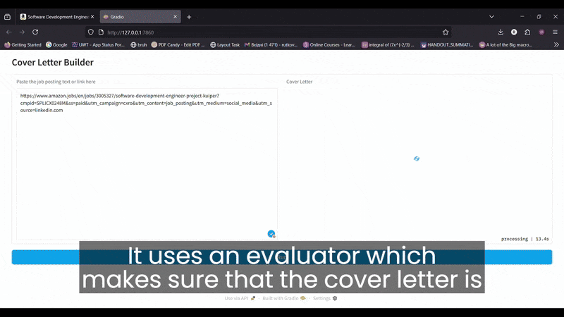
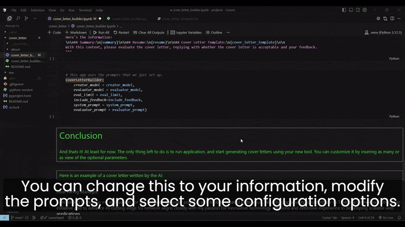

# 📝 Cover Letter

This is a tool to help you create cover letters tailored to you and a provided job description. It uses an evaluator optimizer, to ensure the quality of the AI generated output.

## 📦 Installation & Usage

1. Clone the repository and navigate into it:

   ```bash
   git clone https://github.com/your-username/cover_letter.git
   ```

2. Create a .env file with your OpenAI API key:
   ```env
   OPENAI_API_KEY=your_api_key_here
   ```
3. Run the app using:
   ```bash
   cd cover_letter
   uv run cover_letter_builder.py
   ```

## ✍️ Personalization

To get the best results:

    Fill out your personal info in the about/ folder.

    Replace example name and content with your own.

## 🧠 How It Works

The system uses GPT-4o to draft cover letters and o4-mini to evaluate and iterate. The process continues until a letter passes internal quality checks.

You can modify the models and the prompts in the codebase to suit your needs.

# 🎥 Demo

## 🔧 Starting the Cover Letter Builder



## 💻 Displaying the code



## ✅ Showcasing the results


